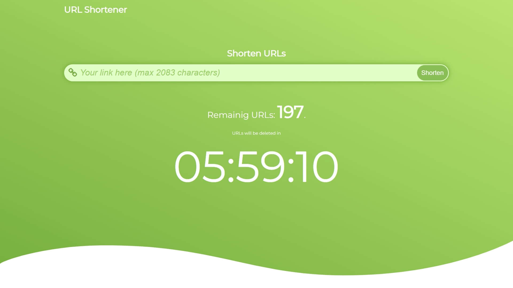

# URL shortener

URL shortener with custom made "imitation" of cron job and limited number for saved URL's.

## Installation

- Import the `database.php` file.

----

If you want to change the database configuration you'll have to changes values inside these files:
- `database.php`
- `app/classes/Database.php` on line 16.
